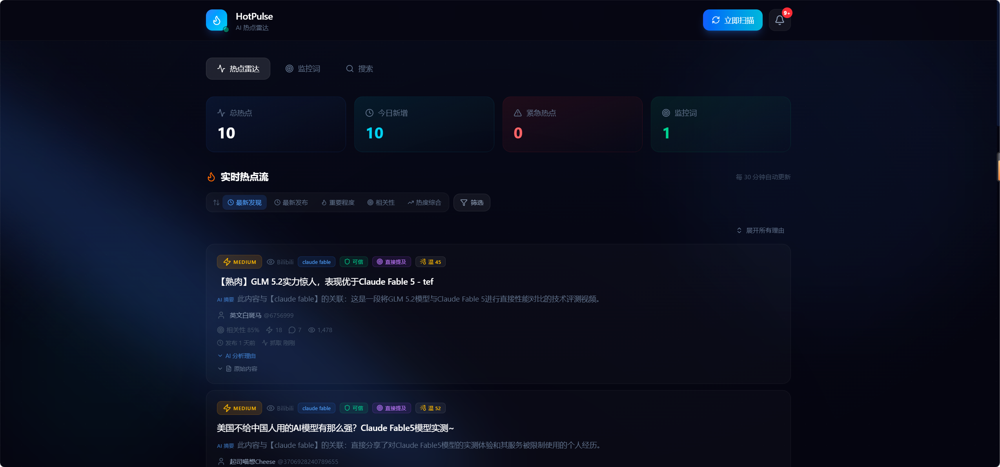

## 一、项目介绍
基于 Express 5 + React 19 + OpenRouter + Socket.io，用 AI 编程的方式从 0 到 1 开发一个《AI 热点监控工具》


输入要监控的关键词，系统自动从 Twitter、Bing、HackerNews、搜狗、B 站等 **8+** 个信息源聚合抓取内容，利用 AI 进行真假识别和相关性分析，并通过 WebSocket 实时推送和邮件通知用户。此外，还将热点监控能力封装为 **Agent Skills 技能包**，让 Cursor、VSCode Copilot、Claude Code 等 AI 编程工具也能直接使用。


## 四、快速运行

> 详细的教程请参考 [本地运行指南](docs/LOCAL_SETUP.md)

### 前置条件

- Node.js ≥ 18（推荐 20 LTS）
- 一个 [OpenRouter API Key](https://openrouter.ai/settings/keys)（必需，用于 AI 分析）

### 1. 克隆并安装依赖

```bash
git clone https://github.com/loyalgod/hot_monitor-.git
cd hot_monitor-

# 后端
cd server
npm install
npx prisma generate
npx prisma db push

# 前端
cd ../client
npm install
```

### 2. 配置环境变量

```bash
cp server/.env.example server/.env
```

编辑 `server/.env`，至少填入 OpenRouter API Key：

```bash
OPENROUTER_API_KEY=sk-or-v1-你的key
# Twitter API Key（可选）
TWITTER_API_KEY=你的key
```

### 3. 启动服务（两个终端）

```bash
# 终端 1：启动后端（端口 3001）
cd server && npm run dev

# 终端 2：启动前端（端口 5173）
cd client && npm run dev
```

访问 **http://localhost:5173** ，输入关键词即可开始监控热点 🔥

| 服务       | 地址                                     |
| ---------- | ---------------------------------------- |
| 前端页面   | http://localhost:5173                    |
| 后端 API   | http://localhost:3001                    |
| 数据库管理 | `cd server && npx prisma studio`（可选） |

更多细节请查看(docs/LOCAL_SETUP.md)。


